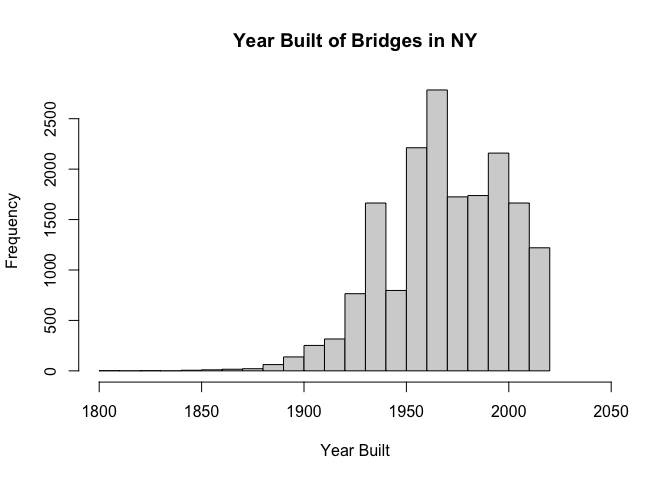

Bridges HW\#1
================
Supraja Battula
9/23/2021

``` r
library(data.table)
bridges = fread("https://www.fhwa.dot.gov/bridge/nbi/2020/delimited/NY20.txt")
new_bridges = data.frame(id = bridges$STRUCTURE_NUMBER_008, year = bridges$YEAR_BUILT_027, fips_codes = bridges$COUNTY_CODE_003, condition_ratings = bridges$BRIDGE_CONDITION, length = bridges$STRUCTURE_LEN_MT_049, location = bridges$LOCATION_009 )
print(head(new_bridges))
```

    ##                id year fips_codes condition_ratings length
    ## 1 000000001000040 1895        119                 F   21.3
    ## 2 000000001000090 1959        119                 F   83.2
    ## 3 000000001000121 1926        119                 P   24.4
    ## 4 000000001000122 1888        119                 F   29.6
    ## 5 000000001000140 2004          1                 F   15.2
    ## 6 000000001000160 1932         83                 F   12.8
    ##                      location
    ## 1 'JCT US 1 & MAMARONECK RVR'
    ## 2           'JCT US 1 & I287'
    ## 3  'JCT RTE 1+N Y+CONN ST LN'
    ## 4  'JCT RTE 1+N Y+CONN ST LN'
    ## 5 '.9 MI S JCT SH 32 & SH378'
    ## 6   'BURDEN AVE RT378 S.TROY'

``` r
hist(new_bridges$year, main = "Year Built of Bridges in NY", xlab = "Year Built",xlim = c(1800,2050))
```

<!-- -->
